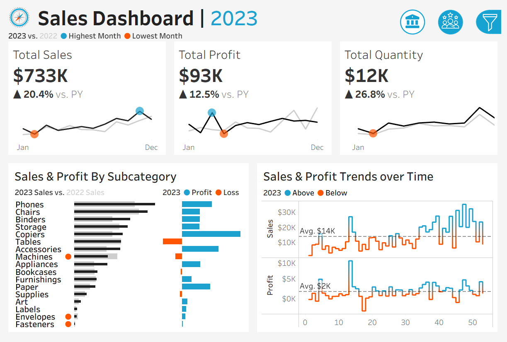
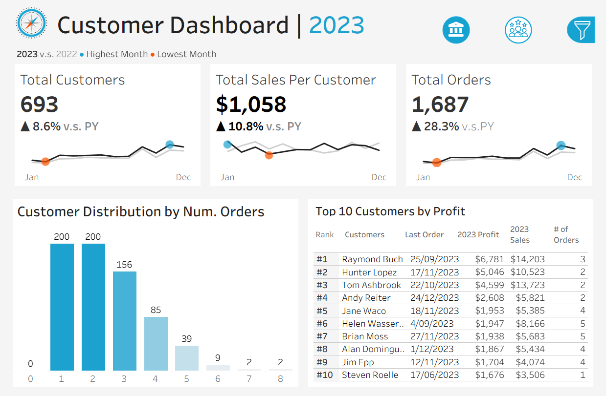

# Sales & Customer Performance Dashbaord (Tableau Mock Project)
This project is an end-to-end Tableau dashboard created as part of my self-directed learning in business intelligence.
Following industry-standard BI workflows, I practiced the full process—from requirement gathering and data modeling, to visualization design, dashboard interaction, and UX optimisation.

The project is orginally created by Baraa Salkini, a well-known Data analyst. More details about the project can refer to the following YouTube video
[Sales & Customer Dashboard](https://youtu.be/dahrmqT5GD4?si=ZGOeLm7v1VcobS5L)

## Project Overview
Bulid a Tableau dashborads (Sales & Customer) that allow business users to:
- Review and understand the business performace
- Compare the current & Previous year performance
- understand the monthly sales trends
- Analyse product sub-category profitability
- Identify top customers by revenue and profit

## BI Workflow
### 1. Requirement Gathering
The user requirment had been completed and organised into a doc file. According to the requriements, the dashboard should include:
1. Sales Dashboard
  - YoY comparison, product category analysis, and Trend analysis
  - Sales KPIs: total sales, total profits, quantity
  - Monthly Trends in sales, profit, and quantity with and highlighted each of the highest and lowest figure in each charts.
2. Customer Dashboard
  - YoY coparison on customer number, sales per customr, and orders
  - Customer distribution by orders
  - Top 10 customers 
Detais: [User Requirments](https://github.com/tzuyuliu123/Sales-Performance-Dashboard/blob/04020120ab2953654e3ceef2f6684fca6d98f8a8/User%20Requirements.docx)
### 2. Dashbaord Wireframe 
The outline of Dashboard followed these images: 
[Dashboard Mock outline](https://github.com/tzuyuliu123/Sales-Performance-Dashboard/blob/f16890c7e8fb410ef96cb814f82ec00b88f40ba3/mockup.pdf)
### 3. Data Model & Preparation 
- Fact Table: Orders.csv
- Dimension Tables: Customers.csv, Products.csv, and Location.csv
  
Data steps include:
- Data type corrention
- Relationship setup
- Creating Calculated fields for YoY comparison and KPIs

Data sources: [Datasets](https://github.com/tzuyuliu123/Sales-Performance-Dashboard/tree/662f0cbb18536522eb80bcaecac0bcf6ac841f7f/datasets)
### 4. Visualisation Design 
1. Sales Dashboard
   - KPIs figure and Line charts: showing the Mmonthly trends in sale, profit and quantity. 
   - Bar charts: Compared the sales and profits with product sub-category
   - Lines charts: showing the weekly slaes and profits trends
2. Customer Dashboard
   - KPIs and Line charts: Monthly trends in customers, sales per customer, and orders
   - Histogram: Customer distribution by orders
   - Table: Shows the top 10 customers with orders details
### 5. Dashborad Preview
The final look of the dashboard

## Tools & Skills  
- Tableau Desktop
- Data Modeling & Relationships
- Dashborad Design
- BI concepts: Dimensions, Facts, Trends
## Key Takeways and Insights

